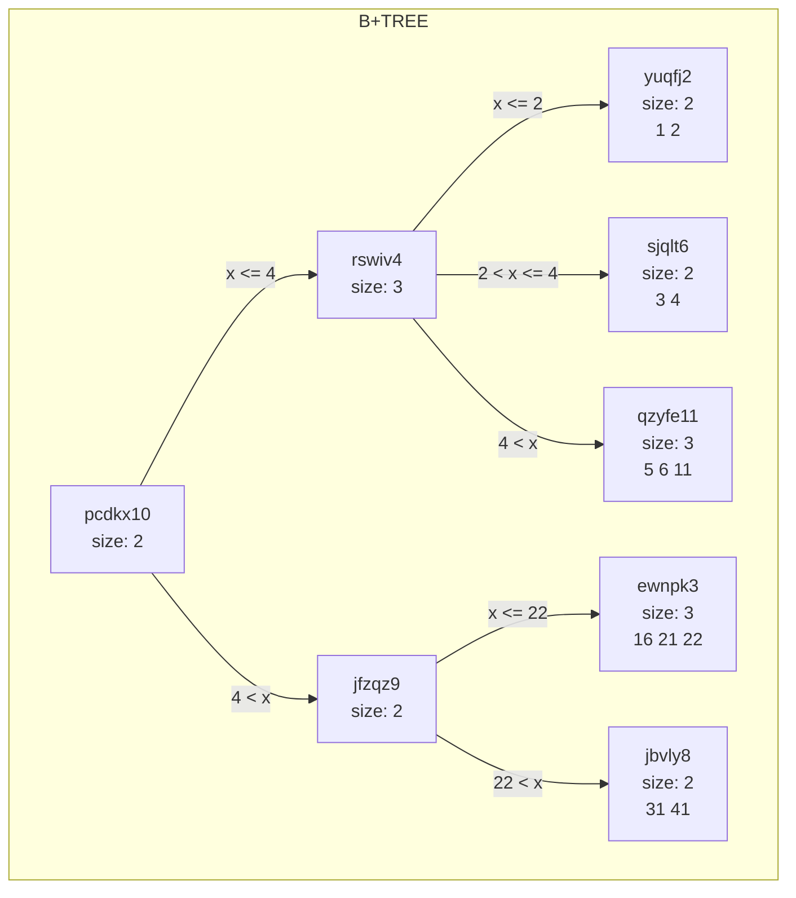
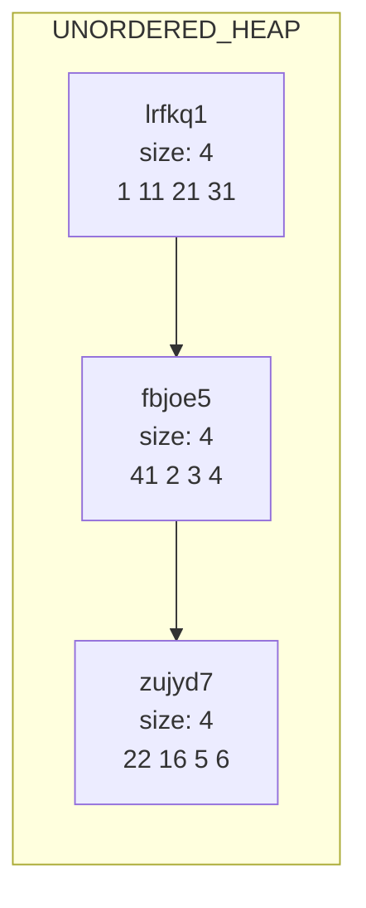

```mermaid
graph TD
subgraph B+TREE
pcdkx10[pcdkx10<br/>size: 2<br/>]
rswiv4[rswiv4<br/>size: 3<br/>]
yuqfj2[yuqfj2<br/>size: 2<br/>1 2 ]
rswiv4-->|x <= 2|yuqfj2
sjqlt6[sjqlt6<br/>size: 2<br/>3 4 ]
rswiv4-->|2 < x <= 4|sjqlt6
qzyfe11[qzyfe11<br/>size: 3<br/>5 6 11 ]
rswiv4-->|4 < x|qzyfe11
pcdkx10-->|x <= 4|rswiv4
jfzqz9[jfzqz9<br/>size: 2<br/>]
ewnpk3[ewnpk3<br/>size: 3<br/>16 21 22 ]
jfzqz9-->|x <= 22|ewnpk3
jbvly8[jbvly8<br/>size: 2<br/>31 41 ]
jfzqz9-->|22 < x|jbvly8
pcdkx10-->|4 < x|jfzqz9
end
```

```mermaid
graph LR
subgraph UNORDERED_HEAP
lrfkq1[lrfkq1<br/>size: 4<br/>1 11 21 31 ]
fbjoe5[fbjoe5<br/>size: 4<br/>41 2 3 4 ]
lrfkq1-->fbjoe5
zujyd7[zujyd7<br/>size: 4<br/>22 16 5 6 ]
fbjoe5-->zujyd7
end
```
